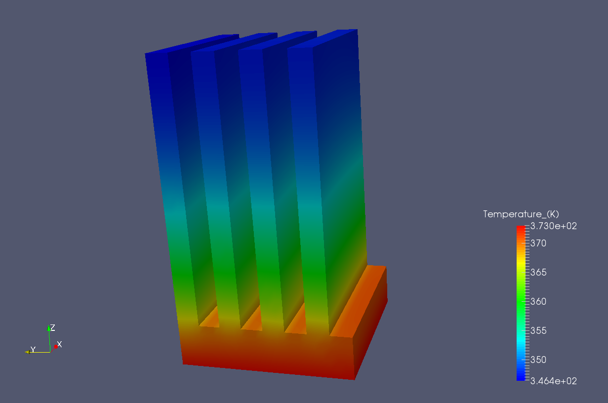

# Diffusion-Equation-solver-for-Hexahedral-Unstructured-Grid
USD is a Finite Volume solver for the Diffusion equation for hexahedral unstructured grids (gmte format). The following is a solution of temperature distribution in a simple heat sink model using USD. The grid file for this model is attached in the repository files.

